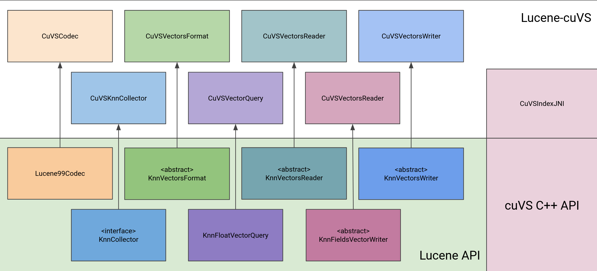

# Lucene CuVS Integration

This is an integration for [CuVS](https://github.com/rapidsai/cuvs), GPU accelerated vector search library from NVIDIA (formerly part of [Raft](https://github.com/rapidsai/raft)), into [Apache Lucene](https://github.com/apache/lucene).

## Architecture

As an initial integration, the CuVS library is plugged in as a new KnnVectorFormat via a custom codec.

By way of a working example, Wikipedia corpus (1.3M documents) can be indexed, each document having a content vector. Queries (questions.vec.txt) can be executed after the indexing.

> :warning: This is not production ready yet.

## Running

Install NVIDIA drivers, CUDA 12.3+, Maven 3.9.6+ and JDK 21.

    # 1.3 Million wikipedia documents with vector embeddings, along with some query embeddings
    wget -c https://accounts.searchscale.com/wikipedia_vector_dump.csv.gz
    wget -c https://accounts.searchscale.com/questions.vec.txt
    wget -c https://accounts.searchscale.com/questions.raw.txt

    mvn org.apache.maven.plugins:maven-install-plugin:2.5.2:install-file -Dfile=cuvs-searcher-cuda-0.1.jar
    mvn package

    java -cp lucene/target/cuvs-searcher-lucene-0.0.1-SNAPSHOT.jar:cuvs-searcher-cuda-0.1.jar com.searchscale.lucene.vectorsearch.benchmarks.LuceneVectorSearchExample <dump_file> <vector_column_number> <vector_column_name> <number_of_documents_to_index> <vector_dimension> <query_file> <commit_at_number_of_documents> <topK> <no. of HNSW indexing threads> <no. of cuvs indexing threads> <merge_strategy options: NO_MERGE | TRIVIAL_MERGE | NON_TRIVIAL_MERGE> <queryThreads> <hnswMaxConn> <hnswBeamWidth> <hnswVisitedLimit> <cagraIntermediateGraphDegree> <cagraGraphDegree> <cagraITopK> <cagraSearchWidth>

    Example:
    java -Xmx32G -cp lucene/target/cuvs-searcher-lucene-0.0.1-SNAPSHOT.jar:cuvs-searcher-cuda-0.1.jar com.searchscale.lucene.vectorsearch.benchmarks.LuceneVectorSearchExample wikipedia_vector_dump.csv.gz 3 article_vector 12000000 768 query.txt 300000 10 32 32 NO_MERGE 1 16 100 10 128 64 5 1

    (Outputs will be available in benchmarks-results.json and neighbors.csv)

## Contributors

* Vivek Narang, SearchScale
* Ishan Chattopadhyaya, SearchScale & Committer, Apache Lucene & Solr
* Corey Nolet, NVIDIA
* Puneet Ahuja, SearchScale
* Kishore Angani, SearchScale
* Noble Paul, SearchScale & Committer, Apache Lucene & Solr
