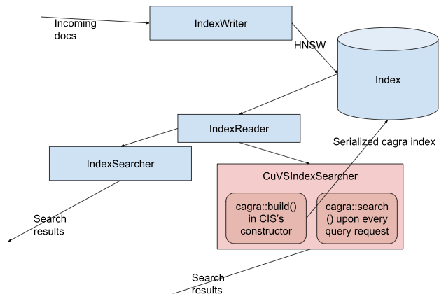

# Lucene CuVS Integration

This is an integration for [CuVS](https://github.com/rapidsai/cuvs), GPU accelerated vector search library from NVIDIA (formerly part of [Raft](https://github.com/rapidsai/raft)), into [Apache Lucene](https://github.com/apache/lucene).

## Architecture

As an initial integration, the CuVS library is plugged in as an IndexSearcher. This project has two layers: (1) Java/JNI layer in `lucene` dir, (2) CuVS/C++ layer in `cuda` dir.

By way of a working example, OpenAI's Wikipedia corpus (25k documents) can be indexed, each document having a content vector. A provided sample query (query.txt) can be executed after the indexing.

> :warning: This is not production ready yet.

## Running

Install RAFT (https://docs.rapids.ai/api/raft/stable/build/#installation)

Set the correct path for Raft in `cuda/CMakeLists.txt` file. Then, proceed to run the following (Wikipedia OpenAI benchmark):

    wget -c https://cdn.openai.com/API/examples/data/vector_database_wikipedia_articles_embedded.zip
    mvn package
    java -jar lucene/target/cuvs-searcher-lucene-0.0.1-SNAPSHOT-jar-with-dependencies.jar

## Benchmarks

Wikipedia (768 dimensions, 1M vectors):

|                                | Indexing   | Improvement | Search | Improvement |
| ------------------------------ | ---------- | ----------- | ------ | ----------- |
| CuVS (RTX 4090, NN_DESCENT)    | 38.80 sec  |  **25.6x**  |  2 ms  |   **4x**    |
| CuVS (RTX 2080 Ti, NN_DESCENT) | 47.67 sec  |  **20.8x**  |  3 ms  |   **2.7x**  |
| Lucene HNSW (Ryzen 7700X, single thread)      | 992.37 sec |       -     |  8 ms  |      -      |

Wikipedia (2048 dimensions, 1M vectors):

|                                           | Indexing   | Improvement |
| ----------------------------------------- | ---------- | ----------- |
| CuVS (RTX 4090, NN_DESCENT)               | 55.84 sec  |  **23.8x**  |
| Lucene HNSW (Ryzen 7950X, single thread)  | 1329.9 sec |       -     |

## Next steps

* Instead of extending the IndexSearcher, create a [KnnVectorFormat](https://github.com/apache/lucene/blob/main/lucene/core/src/java/org/apache/lucene/codecs/KnnVectorsFormat.java) and corresponding KnnVectorsWriter and KnnVectorsReader for tighter integration.

## Contributors

* Vivek Narang, SearchScale
* Ishan Chattopadhyaya, SearchScale & Committer, Apache Lucene & Solr
* Kishore Angani, SearchScale
* Noble Paul, SearchScale & Committer, Apache Lucene & Solr
